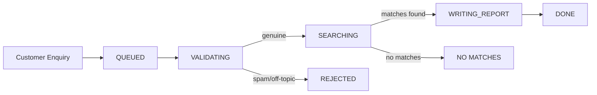
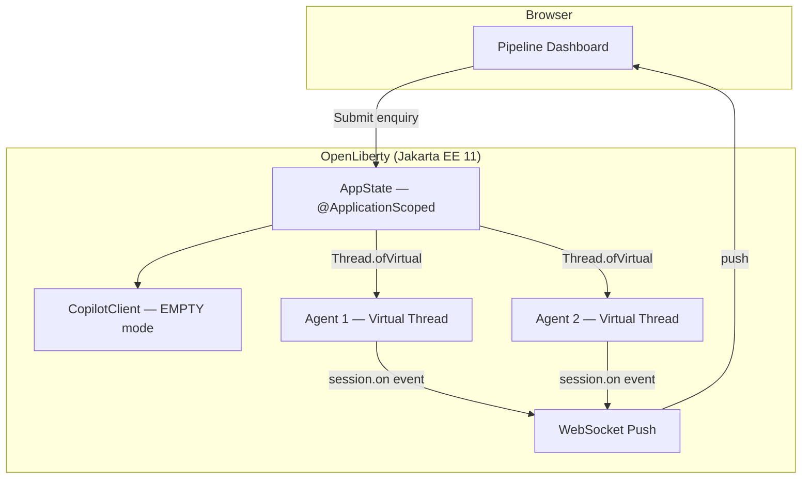

# Introducing the GitHub Copilot SDK for Java

## Enterprise Java developers have a new superpower: drive GitHub Copilot from idiomatic Java code — annotations, virtual threads, more.

The GitHub Copilot SDK for Java is a client library that empowers your server-side Java code create Copilot agent sessions, register tools, send prompts, and receive structured responses — all programmatically. It runs headless, so it works in server environments, including Jakarta EE and Spring. If you've been building enterprise Java for any length of time, this SDK will feel like home: `CompletableFuture`, annotations, lambdas, virtual threads — it's all here.

This post introduces the SDK, walks through a complete Jakarta EE 11 sample application, and leaves you with concrete next steps to try it yourself.

---

## What is the Copilot SDK for Java?

The Copilot SDK for Java is a Java-idiomatic client library for the GitHub Copilot agent platform. Rather than a thin REST wrapper or a language-agnostic shim, the SDK was designed from the ground up to feel natural to Java developers. You create a `CopilotClient`, open sessions, define tools using annotations or lambdas, and let the model drive an agentic loop that calls your tools, on a provided `Executor` if desired, and produces structured output.

The SDK operates in headless mode (`CopilotClientMode.EMPTY`), meaning it talks directly to the Copilot CLI without needing an IDE. This makes it ideal for server-side applications — web apps, microservices, batch processors — anywhere you want Copilot intelligence in your backend.

## Where to get it

The SDK is available as a Maven dependency:

```xml
<dependency>
    <groupId>com.github</groupId>
    <artifactId>copilot-sdk-java</artifactId>
    <version>1.0.7-preview.1</version>
</dependency>
```

**Prerequisites:**
- JDK 17 or 25 (25 recommended — unlocks virtual threads and other modern features)
- Maven 3.9+
- A GitHub account with an active Copilot subscription
- The Copilot CLI installed at `~/.copilot/` (or set `COPILOT_HOME` to its location)

## Why you want it

### A Java-idiomatic API

The SDK speaks fluent Java:

- **`CompletableFuture` everywhere** — all async operations (`client.start()`, `client.createSession()`, `session.sendAndWait()`) return `CompletableFuture`. Chain them, compose them, or `.get()` on a virtual thread — your choice.

- **`AutoCloseable` / try-with-resources** — `CopilotClient` and `CopilotSession` both implement `AutoCloseable`, so resource cleanup follows the standard Java pattern.

- **Annotation-driven tool definitions** — `@CopilotTool` and `@CopilotToolParam` let you declare tools the way enterprise Java developers declare REST endpoints or message-driven beans. Annotations are the lingua franca of enterprise Java.

- **Lambdas for inline tools** — `ToolDefinition.from(...)` supports functional-style tool definitions when you want something lighter.

### Much-beloved Java features the SDK supports

| Feature | How the SDK uses it |
|---------|-------------------|
| **Virtual Threads** | Each agent session runs on its own virtual thread — spin up thousands of concurrent agents without thread-pool tuning. |
| **Multi-Release JARs** | The SDK runs on JDK 17 or 25 and extracts the best from each. MRJAR packaging means newer JDK features are used when available; older runtimes still work. |
| **Text Blocks** | Write system prompts as readable multi-line `"""..."""` strings — no concatenation gymnastics. |
| **Records** | SDK event data uses record-like accessor patterns; your own tool code can use records freely. |
| **Pattern Matching `instanceof` (JDK 16+)** | Handle session events with `if (event instanceof AssistantMessageEvent msg)` — clean, type-safe dispatching. |

### Tool support inspired by LangChain4j

The SDK offers three tool-definition styles, so you can choose the right level of ceremony for each situation:

1. **Annotations** (`@CopilotTool`) — declare tools alongside your business logic.
2. **Lambdas** (`ToolDefinition.from(...)`) — define tools inline at the call site.
3. **Low-level JSON Schema** (`ToolDefinition.create(...)`) — full control over the tool's parameter schema.

You can also scan tools from any object with `ToolDefinition.fromObject(instance)`, and override built-in tools with `.overridesBuiltInTool(true)`.

---

## Walk through the sample app

The best way to see the SDK in action is to run the sample application from the Microsoft Build 2026 session [BRK206 — Your Agent Anywhere](https://github.com/microsoft/Build26-BRK206-your-agent-anywhere-multiclient-multidevice-with-github-copilot-sdk).

### Get the code

```bash
git clone https://github.com/microsoft/Build26-BRK206-your-agent-anywhere-multiclient-multidevice-with-github-copilot-sdk.git
cd src/java-agent-orchestrator
mvn clean package liberty:run
# Open http://localhost:9080/index.xhtml
```

The Java demo is built on:

| Concern | Technology |
|---------|-----------|
| Runtime | OpenLiberty 26.0.0.5 |
| Platform | Jakarta EE 11 (Faces 4.1, CDI 4.1, WebSocket 2.2, Data 1.0, Persistence 3.2) |
| UI | PrimeFaces 15.0.16 |
| AI orchestration | Copilot SDK for Java 1.0.7-preview.1 |
| Database | H2 in-memory (10 seed property listings) |

### What the app does

The application is a real-estate lead-management agent pipeline. A customer submits an enquiry ("I'm looking for a 3-bedroom house in London under £800,000"), and the system spins up an isolated Copilot Agent on a virtual thread to process it through a pipeline:



The architecture uses Jakarta WebSocket to push real-time status updates from the server to the browser, so you can watch agents progress through phases as the model calls tools:



Submit multiple enquiries simultaneously to see concurrent virtual-thread agents in action — each one processes independently with its own Copilot session.

### SDK features in action

Let's walk through the key SDK features as they appear in the sample code.

#### Defining tools with `@CopilotTool`

This is the headline API. If you've ever written a `@GET` endpoint in JAX-RS or an `@MessageDriven` bean, this will feel instantly familiar:

```java
@CopilotTool(value = "Sets the current phase of the agent. Use this to report progress.",
             name = "set_current_phase")
public String setCurrentPhase(
        @CopilotToolParam("The phase to transition to (VALIDATING, SEARCHING, "
                + "WRITING_REPORT, REJECTED_GARBAGE, REJECTED_NO_MATCHES, or DONE)")
        String phaseName) {
    phase = Phase.valueOf(phaseName.trim().toUpperCase(Locale.ROOT));
    notifyUi();
    return "Phase set to " + phase.getLabel();
}
```

The `@CopilotTool` annotation declares the method as a tool the model can call. The `@CopilotToolParam` annotation describes each parameter so the model knows what to pass. The SDK handles all the JSON Schema generation, argument parsing, and dispatch — you just write a normal Java method.

**Two build prerequisites for `@CopilotTool`.** The annotation-based tool API is currently an experimental feature of the SDK, so you need to configure two things in your Maven build:

1. **Enable experimental APIs** — pass `-Acopilot.experimental.allowed=true` to the compiler. Without this flag, the annotation processor will refuse to generate the tool metadata. For more details on the experimental APIs see [Copilot SDK documentation](https://github.com/github/copilot-sdk/tree/main/java#using-experimental-apis).

2. **Register the annotation processor** — add the SDK as an `annotationProcessorPath` so the compiler can find the `@CopilotTool` processor and generate the `$$CopilotToolMeta` classes at compile time.

Both are configured in the `maven-compiler-plugin`:

```xml
<plugin>
    <groupId>org.apache.maven.plugins</groupId>
    <artifactId>maven-compiler-plugin</artifactId>
    <version>3.15.0</version>
    <configuration>
        <compilerArgs>
            <arg>-Acopilot.experimental.allowed=true</arg>
        </compilerArgs>
        <annotationProcessorPaths>
            <path>
                <groupId>com.github</groupId>
                <artifactId>copilot-sdk-java</artifactId>
                <version>1.0.7-preview.1</version>
            </path>
        </annotationProcessorPaths>
    </configuration>
</plugin>
```

To register all annotated tools from an object:

```java
List<ToolDefinition> annotatedTools = ToolDefinition.fromObject(this);
```

#### Inline lambda tools with `ToolDefinition.from(...)`

When you want a tool defined at the call site without a dedicated method, use the lambda style:

```java
ToolDefinition reportIntentTool = ToolDefinition
        .from("report_intent",
              "Reports the current intent of the agent",
              Param.of(String.class, "intent", "Intent in max 4 words"),
              (String intent) -> {
                  currentIntent = intent;
                  addEvent(Instant.now(), "intent", "Intent updated", intent);
                  notifyUi();
                  return "ok";
              })
        .overridesBuiltInTool(true);
```

Notice `.overridesBuiltInTool(true)` — this tells the SDK that our `report_intent` tool deliberately replaces a built-in tool of the same name. This is useful when you need custom behaviour for a tool the model already knows about.

#### Cross-class tool scanning

Tools don't have to live in the same class as your agent logic. Here's `searchProperties` defined in a separate CDI bean:

```java
@ApplicationScoped
public class PropertyDatabase {

    @CopilotTool(value = "Searches the real estate listings database. "
                       + "Returns up to 10 matching properties.",
                 name = "search_properties")
    public List<Property> searchProperties(
            @CopilotToolParam("Property type substring (e.g. 'flat', 'house')") String type,
            @CopilotToolParam("City substring (e.g. 'London', 'Bristol')") String city,
            @CopilotToolParam("Minimum number of bedrooms (0 for no minimum)") int minBedrooms,
            @CopilotToolParam("Maximum price in GBP (0 for no maximum)") double maxPriceGbp) {
        // ... filter and return matching properties ...
    }
}
```

You would normally register these with `ToolDefinition.fromObject(propertyDatabase)`. In the sample app, we use a lambda wrapper instead because CDI client proxies can obscure the annotation metadata — a practical consideration when integrating with dependency injection containers.

#### Customizing the system message

The SDK gives you fine-grained control over the system message. Use `SystemMessageMode.CUSTOMIZE` to replace specific sections while preserving the rest:

```java
SystemMessageConfig systemMessage = new SystemMessageConfig()
        .setMode(SystemMessageMode.CUSTOMIZE)
        .setSections(Map.of(SystemMessageSections.IDENTITY,
            new SectionOverride()
                .setAction(SectionOverrideAction.REPLACE)
                .setContent("""
                    You are part of a real estate recommendation system.
                    You will receive enquiries from customers, and you must
                    carry out the following workflow...
                    """)));
```

The text block (`"""..."""`) makes multi-line prompts readable without string concatenation. The `IDENTITY` section override replaces only the model's self-description while leaving safety guardrails intact. If you prefer a simpler approach, `SystemMessageMode.APPEND` adds your content after the default system message without replacing anything.

#### The agentic loop: `sendAndWait(...)`

One line kicks off the full agentic loop:

```java
session = client.createSession(sessionConfig).get();
// ...
AssistantMessageEvent result = session.sendAndWait(escapedEnquiry).get();
```

Behind `.get()`, the model reasons, calls your tools (potentially multiple times), and returns its final response. On a virtual thread, `.get()` is cheap — no platform thread is consumed while waiting. The SDK dispatches tool calls to your registered handlers automatically and feeds results back to the model until it's done.

#### Real-time event handling with `session.on(...)`

Subscribe to session events to build responsive UIs:

```java
sessionSubscription = session.on(event -> {
    captureSessionEvent(event);
    uiUpdateSocket.pushDetailUpdate(id);
});
```

Every tool call, every result, every assistant message fires an event. The sample app captures these events and pushes them to the browser via Jakarta WebSocket, so the pipeline dashboard updates in real time. You can use pattern matching to handle specific event types:

```java
if (event instanceof AssistantMessageEvent msg) {
    finalReport = msg.getData().content();
} else if (event instanceof ToolExecutionStartEvent start) {
    // Tool is being invoked...
}
```

#### Headless client and permission handling

The client is configured for server-side operation:

```java
copilotClient = new CopilotClient(
        new CopilotClientOptions()
                .setMode(CopilotClientMode.EMPTY)
                .setCopilotHome(copilotHome)
                .setExecutor(contextualVirtualThreadExecutor));
```

`CopilotClientMode.EMPTY` means no IDE integration — the client talks directly to the Copilot CLI. The custom `Executor` (discussed below) ensures tool callbacks run with container context.

For permission handling, the sample uses:

```java
sessionConfig.setOnPermissionRequest(PermissionHandler.APPROVE_ALL)
```

`APPROVE_ALL` is appropriate for demos and development. In production, implement a real permission policy that validates which tools the model is allowed to invoke.

### Jakarta EE integration patterns

The SDK is not a framework island. It composes naturally with Jakarta EE — and of course also with proprietary frameworks such as Spring.

**The `Executor` parameter is the key integration point.** By passing a custom executor to `CopilotClientOptions`, you control which threads run your tool callbacks. In a Jakarta EE container, this means you can propagate CDI context, JPA persistence contexts, and transaction boundaries into tool methods:

```java
Executor contextualVirtualThreadExecutor = runnable ->
        Thread.ofVirtual().start(contextService.contextualRunnable(runnable));
```

This one-liner creates virtual threads that carry the container's context. When the SDK dispatches a tool call to `searchProperties()`, that method can `@Inject` a JPA repository and query the database — because the container context is present on the callback thread.

Other integration patterns in the sample:
- **CDI `@ApplicationScoped`** for the singleton `CopilotClient` (one client per application lifecycle).
- **Jakarta Faces `f:websocket` push** for real-time browser updates via `PushContext`.
- **Jakarta Data `@Repository`** for type-safe database queries without raw JPA boilerplate.

**Fine-grained tool access control with `ToolSet`.** The `SessionConfig` lets you specify exactly which tools each session can access:

```java
sessionConfig.setAvailableTools(new ToolSet()
        .addCustom("*")           // all registered custom tools
        .addBuiltIn("web_fetch")) // only the web_fetch built-in
```

This is an important production concern. Rather than exposing every built-in tool (file system access, shell execution, etc.), you explicitly opt in to only what the agent needs. In the sample app, we allow all custom tools plus `web_fetch` so the agent can look up real-time property information during the Search phase.

---

## Summary

Here's what we covered:

- **Java-native API** — `CompletableFuture`, annotations, lambdas, and virtual threads make the SDK feel like idiomatic Java, not a ported-from-another-language afterthought.
- **Three tool-definition styles** — annotations for enterprise patterns, lambdas for inline convenience, JSON Schema for full control.
- **System message customization** — section-level overrides give you precise control over agent behaviour.
- **The agentic loop in one line** — `sendAndWait(...)` handles the full tool-calling loop automatically.
- **Real-time event streaming** — `session.on(...)` enables responsive UIs and observability.
- **Headless server-side operation** — no IDE required; runs anywhere the Copilot CLI is available.
- **Natural composition with Jakarta EE** — CDI, JPA, WebSocket, and virtual threads all work together through the `Executor` integration point.

## What to try next

- **Clone the sample app** and run it locally — submit multiple enquiries simultaneously to see virtual threads in action.
- **Swap the model** — try `session.setModel(...)` to experiment with different Copilot models.
- **Add your own tool** — define a new `@CopilotTool` method (a mortgage calculator, a school-district lookup) and watch the agent discover and use it.
- **Deploy to Azure** — OpenLiberty runs great on Azure App Service, AKS, or Azure Container Apps. See the Jakarta EE on Azure guidance at <https://aka.ms/java/ee>.

The Copilot SDK for Java puts the full power of GitHub Copilot behind your Java code — no IDE required, no framework lock-in. Clone the sample, run `mvn liberty:run`, and see for yourself.

---

<sup>**Footnote:** The SDK is also compatible with **Structured Concurrency** (JDK 25 preview) for coordinating multiple sessions in a single scope, and **Sealed classes** for exhaustive event-type handling. These are more advanced patterns — if you're already using them in your codebase, they compose naturally with the SDK's event and session APIs.</sup>
